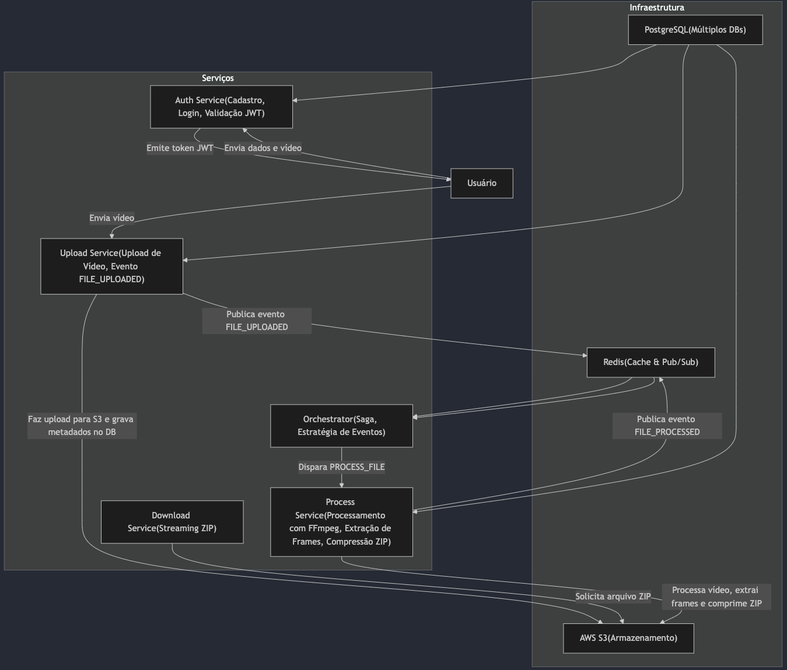

# Documento de Arquitetura – Projeto Frame Flow

## 1. Introdução
Este documento descreve a arquitetura do sistema Frame Flow, um sis
tema distribuído de processamento de vídeos baseado em microsserviços. Nele, detalhamos como passamos por um processo de Event Storming para identificar eventos críticos e definir os limites dos contextos de domínio (bounded contexts) conforme os princípios do Domain‑Driven Design (DDD).
O objetivo é criar um sistema escalável, resiliente e modular, onde cada serviço é responsável por uma parte específica do fluxo de processamento de vídeo.

## 2. Visão Geral do Sistema
O Frame Flow é composto por vários microsserviços, cada um responsável por um domínio específico:

- Auth Service: Gerencia o cadastro, autenticação e validação de tokens JWT dos usuários.

- Upload Service: Recebe vídeos enviados pelos usuários, valida os arquivos (tamanho e extensão), realiza o upload para o AWS S3, armazena metadados no banco de dados e publica eventos de upload no Redis.

- Process Service: Baixa vídeos do S3, processa-os com FFmpeg (extraindo frames em intervalos de 10 segundos), comprime os frames em um arquivo ZIP e faz o upload do ZIP para o S3. Em seguida, publica eventos de processamento.

- Download Service: Fornece o streaming ou download dos arquivos ZIP processados.

- Orchestrator (Saga Orchestrator): Coordena o fluxo distribuído entre os serviços utilizando o padrão Saga, escutando os eventos via Redis Pub/Sub e tomando decisões com base nos eventos recebidos.

A infraestrutura de suporte inclui:

- PostgreSQL: Banco de dados, onde cada serviço utiliza seu próprio banco (ou esquema) para manter a separação dos dados.
- Redis: Usado para operações rápidas (cache) e, principalmente, para Pub/Sub centralizado, permitindo comunicação assíncrona entre os serviços.
- AWS S3: Responsável pelo armazenamento de vídeos, frames e arquivos ZIP.

## 3. Metodologia de Desenvolvimento e Event Storming

### 3.1. Abordagem Colaborativa
O desenvolvimento do sistema passou por sessões de Event Storming, onde a equipe se reuniu para mapear os eventos de domínio e identificar os processos críticos. Durante essas sessões, foram discutidos:

- Eventos: Quais são as mudanças de estado que ocorrem no sistema (por exemplo, FILE_UPLOADED, PROCESS_FILE, FILE_PROCESSED).
- Comandos: Ações que iniciam esses eventos (por exemplo, UploadVideo, ProcessVideo).
- Agregados: Entidades centrais de cada contexto, como Usuário, Vídeo e Job de Processamento.
- Fluxo de Trabalho: Como os eventos interagem e se transformam no fluxo distribuído, estabelecendo o padrão Saga para garantir a consistência entre os serviços.

### 3.2. Principais Eventos Mapeados
Durante o event storming, os seguintes eventos foram identificados como críticos:

- FILE_UPLOADED: Disparado pelo Upload Service após um vídeo ser carregado e armazenado no S3.
- PROCESS_FILE: Comando (ou evento) que inicia o processamento do vídeo, disparado pelo Orchestrator.
- FILE_PROCESSED: Disparado pelo Process Service após a extração dos frames, compressão e upload do ZIP.
- FILE_FAILED: Evento que indica falha no processamento, permitindo que mecanismos de compensação sejam acionados.

Cada evento foi formalmente modelado utilizando Pydantic para garantir a integridade e a consistência dos dados que circulam entre os serviços.

## 4. Modelagem do Domínio com DDD

### 4.1. Bounded Contexts
Cada serviço foi definido como um bounded context independente:

- Auth Context: Focado na segurança e gerenciamento de usuários.
- Upload Context: Responsável pelo gerenciamento do ciclo de vida do upload de vídeos.
- Process Context: Concentra toda a lógica de processamento dos vídeos (extração, compressão e upload dos resultados).
- Download Context: Especializado em entregar os resultados processados para o usuário.
- Orchestration Context: Coordena e orquestra o fluxo de eventos entre os contextos.

### 4.2. Agregados e Entidades

- Usuário: Representado no Auth Service, com informações de login, senha e perfil.
- Vídeo: Entidade gerenciada pelo Upload Service, com metadados e caminho no S3.
- Job de Processamento: Gerenciado pelo Process Service, que mantém o status, os frames extraídos e o arquivo ZIP resultante.

A modelagem de dados e a separação de responsabilidades foram feitas de forma a minimizar o acoplamento entre os contextos e facilitar a escalabilidade e manutenção do sistema.

### 5. Arquitetura dos Microsserviços

### 5.1. Comunicação e Integração

- APIs HTTP: Os serviços se comunicam por meio de APIs RESTful usando FastAPI.
- Redis Pub/Sub: Um canal centralizado (por exemplo, saga_events) é usado para a comunicação assíncrona entre serviços. O Orchestrator escuta e despacha ações com base nos eventos recebidos.
- AWS S3: Utilizado para armazenamento dos vídeos, dos frames extraídos e dos arquivos ZIP. Cada vídeo é armazenado em uma estrutura de pastas que agrupa os arquivos pelo ID do usuário.

### 5.2. Persistência

Cada serviço possui seu próprio banco de dados ou esquema no PostgreSQL, garantindo que as informações sejam isoladas e seguras. O uso de volumes persistentes no Docker garante que os dados não sejam perdidos entre reinicializações dos contêineres.

### 5.3. Decisões de Arquitetura

- Redis foi escolhido por sua capacidade de fornecer respostas rápidas e seu suporte ao Pub/Sub, essencial para a orquestração dos fluxos de eventos entre os serviços.
- Limites de Arquivo e Frames:
    - Foi decidido um limite de 100 MB para o upload de vídeos, balanceando entre performance e usabilidade.
    - A extração de frames a cada 10 segundos foi definida com base em testes que demonstraram ser um ponto ótimo para manter a qualidade e reduzir a carga de processamento.

- Escalabilidade e Resiliência:
    - Cada serviço foi projetado para ser escalado horizontalmente.
    - O uso de uma arquitetura orientada a eventos (padrão Saga) permite a compensação de falhas e a garantia de consistência no fluxo distribuído.

### 6. Diagrama de Arquitetura

### 7. Processo de Event Storming
Durante o processo de Event Storming, a equipe mapeou os seguintes pontos:

- Identificação dos Eventos:
    - FILE_UPLOADED: Gerado quando o Upload Service conclui o upload de um vídeo.
    - PROCESS_FILE: Disparado pelo Orchestrator para iniciar o processamento.
    - FILE_PROCESSED: Publicado pelo Process Service após o processamento e compressão.
    - FILE_FAILED: Caso algum erro ocorra, este evento é publicado para acionar a compensação.

- Mapeamento dos Comandos:
    - Comandos como UploadVideo, ProcessVideo e DownloadFile foram identificados para iniciar os respectivos fluxos.

- Definição de Bounded Contexts:
    - Cada serviço foi definido como um contexto delimitado, com sua própria lógica, persistência e comunicação.

- Decisão de Uso do Redis:
 O Redis foi escolhido para o gerenciamento dos eventos devido à sua performance e simplicidade no padrão Pub/Sub. Isso garante que os eventos sejam rapidamente distribuídos e que a orquestração dos fluxos seja centralizada.

- Limitações Otimizadas:
A decisão de limitar os uploads a 100 MB e extrair frames a cada 10 segundos foi baseada em testes de performance e serve como padrão base para otimizar a carga de processamento e armazenamento.

### 8. Considerações Finais
- Escalabilidade: Cada serviço pode ser escalado horizontalmente, garantindo que o sistema suporte cargas elevadas.
- Resiliência: O uso do padrão Saga e a arquitetura orientada a eventos permitem a implementação de mecanismos de compensação e recuperação de falhas.
- Modularidade: Os serviços são independentes, facilitando a manutenção e evolução do sistema.
- Documentação e Testes: Cada serviço possui sua própria documentação detalhada (ver README específicos) e um conjunto de testes automatizados para garantir a qualidade e integridade do sistema.
